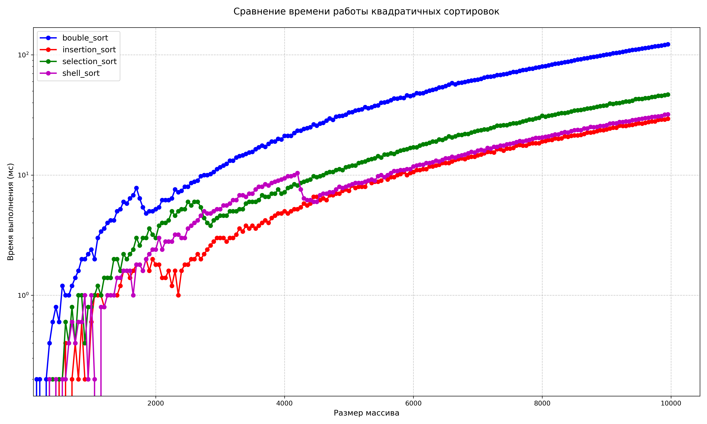
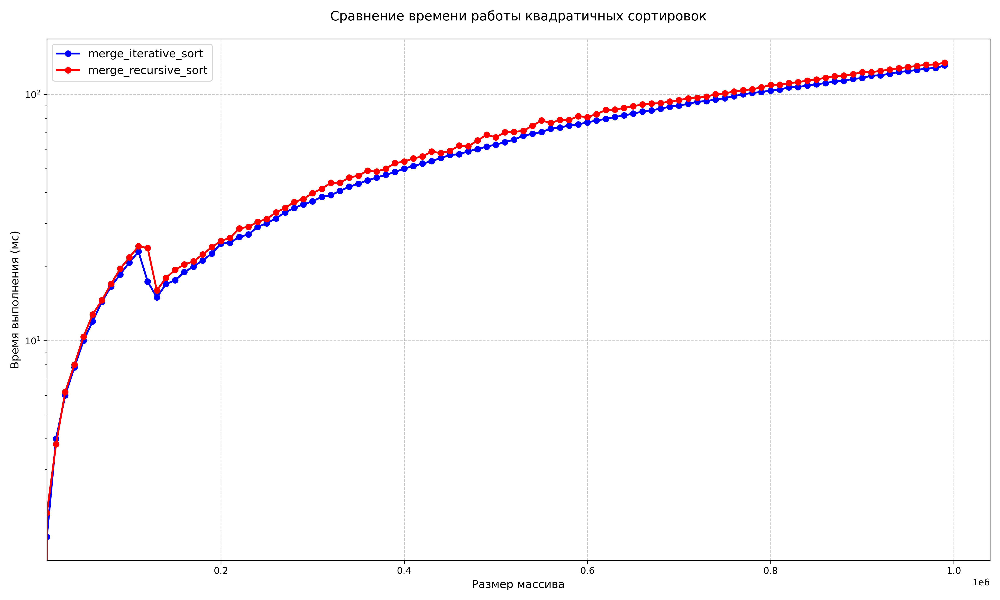
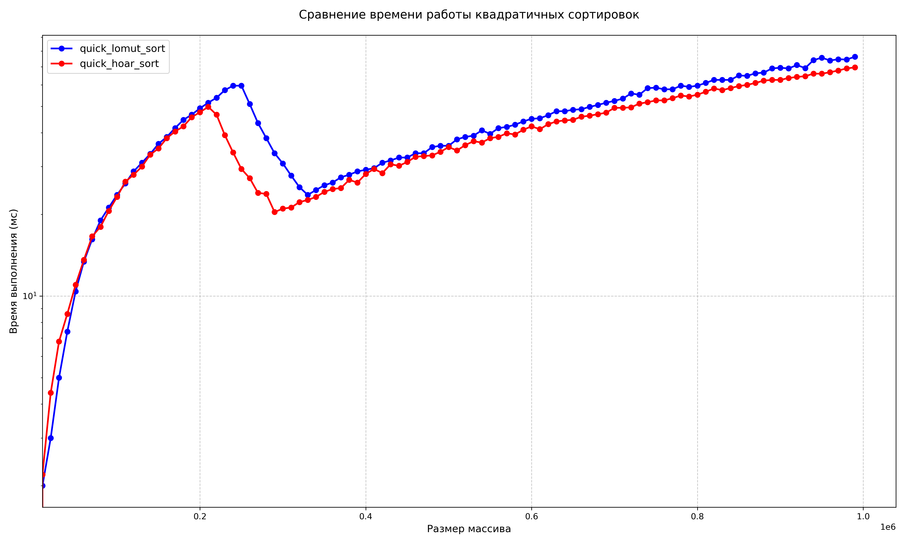

# Сравнение сортировок

## Квадратичные сортировки
В данном пункте мы сравним 4 сортировки:
- Сортировка вставками (```insertion_sort```)
- Сортировка пузырьком (```bubble_sort```)
- Сортировка выбором (```selection_sort```)
- Сортировка Шелла (стратегия для выбора шагов - последовательность Кнута) (```shell_sort```)

Каждая сортировка испытывалась на наборе тестов размером от $1$ до $10000$ (с шагом $50$). Для всех сортировок массивы чисел были одинаковыми.

Для сравнения сортировок построили график:



По графику видно, что ```insertion_sort``` справляется чуть лучше остальных, а ```bubble_sort``` хуже всех.

## Сортировки слиянием
Напишем сортировку слиянием ```merge_sort``` двумя способами: рекурсивную и итеративную.

Каждая сортировка испытывалась на наборе тестов размером от $1$ до $1000000$ (с шагом $10000$). Для сортировок массивы чисел были одинаковыми.

Так же сравним их с помощью графика:


Из графика видно, что сортировки работают почти одинаково. Интеративная версия справляется чуть лучше. У рекурсивной версии есть значительный минус: из-за ограниченной глубины рекурсии она не будет работать на очень больших по размеру массивах.


## Быстрая сортировка

Сравним 2 быстрые сортировки, использующие 2 вида партиционирования:
- Ломуто <!-- (^^_____) -->
- Хоара  <!-- (^_____^) -->

Каждая сортировка испытывалась на наборе тестов размером от $1$ до $1000000$ (с шагом $10000$). Для сортировок массивы чисел были одинаковыми.

Так же сравним их с помощью графика:


Из графика видно, что сортировки работают почти одинаково, партиционирование Хоара справляется немного лучше. Это связано с тем, что при движении указателей "навстречу друг-другу" (Хоара), а не "в догонку" (Ломуто) во время swap-а элементов, может пропасть больше инверсий.

---
Тестирование выполнялось на процессоре AMD Ryzen 7 8845HS
