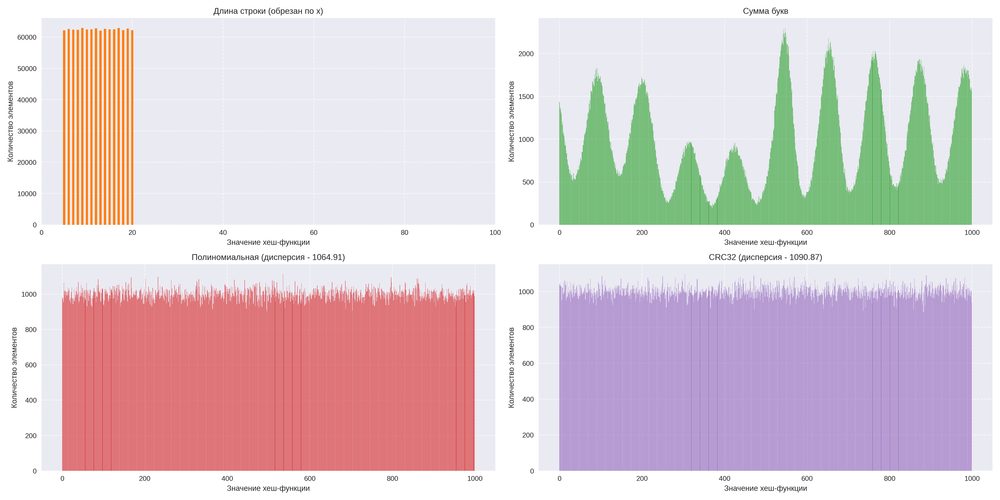
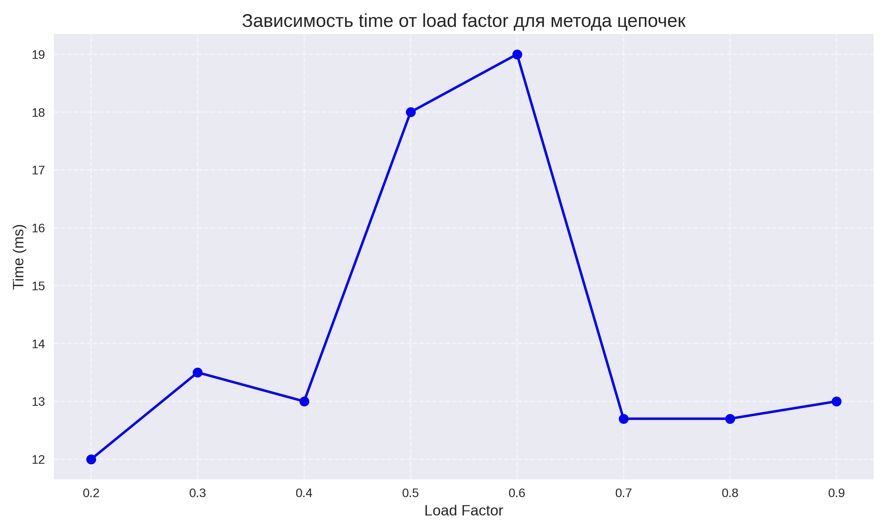

# Хэширование
## Исследование хеш-функций

Исследование проводим с помощью хеш-таблицы, реализованной **методом цепочек**.
В этом пункте бралась хеш таблица фикстрованного размера - $1000$ списков, чтобы наглядно увидеть количество коллизий хеш-функций.

Программы запускались на одинаковых тестах, в котором $1000000$ строк размерами от $5$ до $20$ букв. 

Построим гистограммы коллизий, а так же будем засекать время работы хеш-таблицы

### Рассмотрим элементы типа ```char*```

Время работы в таблице ниже - время работы хеш-таблицы на этом тесте
| Хеш-функция | Время работы, с |
| :-----------: | :------------: |
| Длина строки | $1782,3$ |
| Сумма букв в строке| $39.2$ |
|Полиномиальная| $25.6$ |
|CRC32| $27.1$ |

Гистограммы коллизий:


Видно, что дисперсия у полимиальной хеш-функции дисперсия самая маленькая, поэтому распределение у нее самое равномерное.

Заметим, что хеш-функция длины строки сильно выделяется. Это можно объяснить тем, что вставка в список выполняется за линию (его длину) (а точнее, контроль отсутствия двух одинаковых элементов работает за линию, так как чтобы проверить, есть ли этот элемент в списке, надо пройти по всем элементам). Как можно видеть на гистограмме, длины списков получаются большими, поэтому проход по ним получается очень дорогим по времени.


### Рассмотрим элементы типа ```int```

Тут размер хеш-таблицы был взят $2048$, что бы более наглядно показать, что хеш-функция взятия по модулю не так хороша.

| Хеш-функция | Время работы, мс |
| :-----------: | :------------: |
| Взятие по модулю | $6$ |
| Битовые операции | $13$ |
| Метод умножения с константой А, предложенной Кнутом (Томас Кормен стр. 296). | $12$ |

Гистограммы коллизий:


Тут видно, что взятие по модую не эффективно, так как используется не вся выделенная память, много остается неиспользованным. Самая равномерная среди них - метод, предложенный Кнутом.


## Сравнение Хеш-таблиц

Будем проводить измерение времени для вставок $1000000$ случайных элементов меняя максимальный load factor (```MAX_LOAD_FACTOR```).
Построим графики, чтобы понять какой load factor лучше выбрать для какой таблицы. 

В этом пункте будем пользоваться хеш-функцией, предложенной Кнутом, так как для чисел она получилась самой лучшей.

Начальный размер хеш таблиц здесь брался 2, чтобы происходило изменение размера и перехеширование (```resize```)


### Рассмотрим хеш-таблицу, реализованную **методом цепочек**.

| Load factor | Время работы, мс |
| :-----------: | :------------: |
| 0.9 | $13$ |
| 0.8 | $12.7$ |
| 0.7 | $12.7$ |
| 0.6 | $19$ |
| 0.5 | $18$ |
| 0.4 | $13$ |
| 0.3 | $13.5$ |
| 0.2 | $12$ |

Построим график:


По графику видно, что оптимальный `load factor` - $0.7$. `load factor` меньше $0.4$ плох частым выделением памяти. Так же будет очень много выделенной памяти, которую мы не используем.

**Для хеш-таблицы, реализованной методом цепочек оптимальный `load factor` - $0.7$.**


### Рассмотрим хеш-таблицу с открытой адресацией (линейный метод).

| Load factor | Время работы, мс |
| :-----------: | :------------: |
| 0.9 | $8$ |
| 0.8 | $9$ |
| 0.7 | $8$ |
| 0.6 | $8$ |
| 0.5 | $9$ |
| 0.4 | $8$ |
| 0.3 | $8.3$ |
| 0.2 | $9$ |

Построим график:


По графику видно, что `load factor` везде примерно одинаковый. Это может быть связано с особенностями работы хеш-функции.

Я взяла `load factor` - 0.7, так как он имеет наиболее маленькое значение, и он подходит и к хеш-таблице, реализованной методом цепочек.

**Для хеш-таблицы с открытой адресацией (линейный метод) возьмем `load factor` - $0.7$.**


### Рассмотрим хеш-таблицу с открытой адресацией (квадратичный метод).

| Load factor | Время работы, мс |
| :-----------: | :------------: |
| 0.9 | $8.7$ |
| 0.8 | $9$ |
| 0.7 | $9.7$ |
| 0.6 | $7.7$ |
| 0.5 | $7.7$ |
| 0.4 | $8$ |
| 0.3 | $8$ |
| 0.2 | $7.7$ |

Построим график:


По графику видно, что оптимальный `load factor` - $0.6$.


**Для хеш-таблицы с открытой адресацией (квадратичный метод) оптимальный `load factor` - $0.6$.**